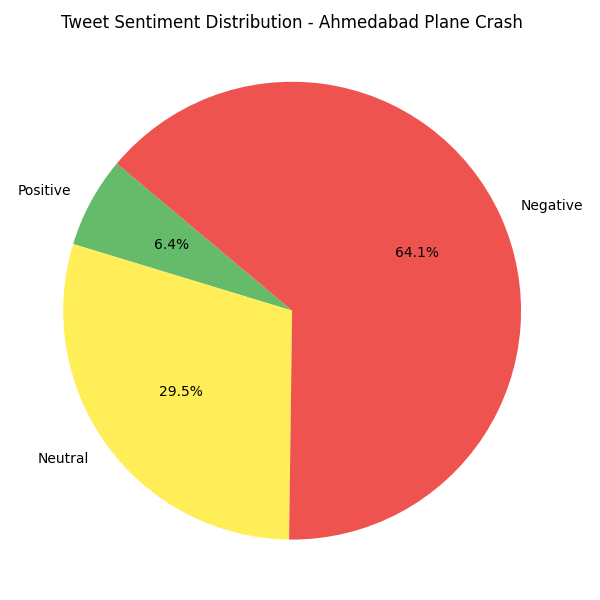

# ✈️ Sentiment Analysis on Ahmedabad Plane Crash Tweets

This project performs real-time **sentiment analysis** on tweets related to the **Ahmedabad plane crash**, classifying them as **Positive**, **Negative**, or **Neutral**. It also visualizes the sentiment distribution and auto-generates a PDF report — creating a complete, end-to-end NLP pipeline using Python.



---

## 📌 Project Overview

🔍 The goal is to extract public sentiment from Twitter to:
- Understand how people reacted to a major real-world event
- Practice real-world data scraping, NLP, and data visualization
- Build a full data pipeline from raw data to visual reports

---

## 🧰 Tech Stack & Tools Used

| Area               | Tools / Libraries                                   |
|--------------------|-----------------------------------------------------|
| 🐍 Programming     | Python 3                                             |
| 🔌 API Access      | [Tweepy](https://www.tweepy.org/) (Twitter API)     |
| 💬 NLP             | [VADER](https://github.com/cjhutto/vaderSentiment), [TextBlob](https://textblob.readthedocs.io/) |
| 📊 Visualization   | Matplotlib                                          |
| 📄 Report Gen      | ReportLab (PDF generation)                          |
| 🔐 Security        | `.env` with `python-dotenv`                         |
| 📁 Git/GitHub      | Version control & public project hosting            |

---

## 📂 Project Structure

```plaintext
sentiment_analysis/
├── fetch_tweets.py                  # Fetches tweets using Twitter API
├── analyze_sentiment.py            # Sentiment analysis using VADER
├── analyze_sentiment_textblob.py   # Sentiment analysis using TextBlob
├── sentiment_summary.py            # Summarizes sentiment counts
├── sentiment_visualization.py      # Creates bar & pie charts
├── generate_pdf_report.py          # Compiles PDF with summary and charts
│
├── tweets.txt                      # Raw fetched tweets
├── sentiment_results.txt           # VADER sentiment output
├── sentiment_results_textblob.txt  # TextBlob sentiment output
├── sentiment_report.pdf            # Final PDF report
├── sentiment_analysis_phases_report.pdf  # Process documentation
│
├── sentiment_pie_chart.png         # Pie chart image
├── sentiment_bar_chart.png         # Bar chart image
│
├── .gitignore                      # Excludes .env and pycache
└── README.md                       # You're here!


🚀 How to Run This Project

📦 Step 1: Install Required Packages
pip install tweepy vaderSentiment textblob matplotlib reportlab python-dotenv
🧪 Step 2: Set Up Twitter API Keys
Create a .env file in your root folder with the following:

CONSUMER_KEY=your_api_key
CONSUMER_SECRET=your_api_secret
ACCESS_TOKEN=your_access_token
ACCESS_TOKEN_SECRET=your_access_secret
(Keep this file private — it's already ignored in .gitignore)

⚙️ Step 3: Run the Pipeline
# Fetch tweets related to the Ahmedabad plane crash
python fetch_tweets.py

# Analyze sentiment using VADER
python analyze_sentiment.py

# (Optional) Analyze sentiment using TextBlob
python analyze_sentiment_textblob.py

# Summarize counts
python sentiment_summary.py

# Visualize the result
python sentiment_visualization.py

# Generate the final PDF report
python generate_pdf_report.py
📊 Example Output

Sentiment	Count (Example)
✅ Positive	23
😐 Neutral	17
❌ Negative	10
🖼️ Pie and bar charts are saved as images and included in the PDF report.

📄 View the full sentiment report (PDF)
📄 View the project workflow documentation (PDF)

📈 Sample Charts


Figure 1: Sentiment Distribution (Pie)


Figure 2: Sentiment Distribution (Bar)

🔒 Security Notice

🚨 The .env file containing Twitter API keys is excluded via .gitignore.
All leaked keys were revoked and cleaned from Git history using BFG Repo-Cleaner.

🙋 Author

Akshat Palia
🎓 Final-Year Tech Student | 📊 Data Analytics Enthusiast
🔗 LinkedIn
🌐 GitHub

⭐ If You Like This Project

Give it a ⭐ on GitHub and feel free to fork or share it!

🧠 Future Improvements

🌐 Deploy as a Streamlit web app
📅 Compare sentiment trends over time
🧠 Add named entity recognition (NER) for topic tagging
☁️ Move PDF generation to cloud


